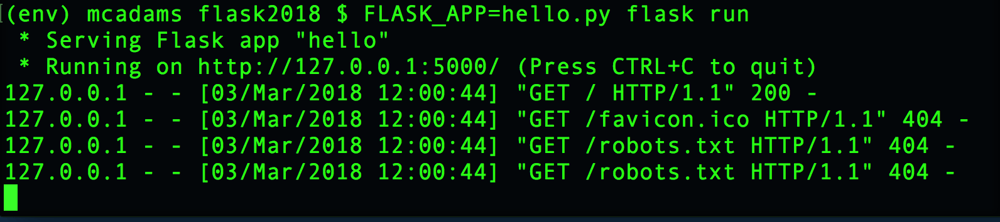
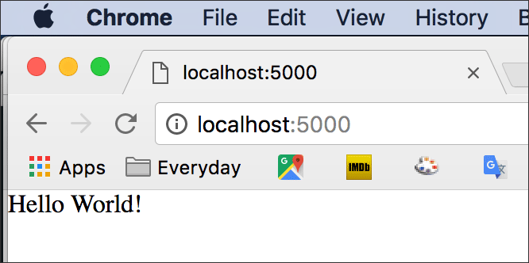

# Introduction to Flask

Flask is a Python framework for building web apps. It's small, light and simple compared with the other widely used Python framework, [Django](https://www.djangoproject.com/).

[This site](http://flask.pocoo.org/) is the home of Flask.

We will install Flask in a new Python3 virtual environment. Students have already installed both Python3 and virtualenv.

[Install Python3, virtualenv, Jupyter](http://bit.ly/install-python3-jupyter)

## Setup for Flask

### Create a directory and change into it

The first step is to create a new folder (directory) for all your Flask projects. Mine is:

```bash
Documents/python/flask
```

**Change into that directory.** For me, the command would be:

```bash
cd Documents/python/flask
```

### Create a new virtualenv in that directory and activate it

Create a new **virtualenv** there (this is done only once):

**Mac OS/bash**
```bash
$ virtualenv --python=/usr/local/bin/python3 env
```

**Windows PowerShell**
```bash
PS> virtualenv --python=C:\Python36\python.exe env
```

Activate the **virtualenv**:

**Mac OS/bash**
```bash
$ source env/bin/activate
```

**Windows PowerShell**
```bash
PS> env\Scripts\activate.bat
```

**Important:** You should now see `(env)` at the far left side of your prompt. This indicates that the **virtualenv** is active. Example (Mac OS/bash):

```bash
(env) mcadams flask $
```

### Install Flask

In Mac OS or Windows, at the `$` bash prompt (or Windows `PS>`), type:

```bash
pip install Flask
```

This is how you install *any* Python library that exists in the [Python Package Index](https://pypi.python.org/pypi). Pretty handy. **pip** is a tool for installing Python packages, which is what you just did.

**Note:** You installed Flask in the Python3 **virtualenv** that is currently active. When that **virtualenv** is *not* active, Flask will not be available to you. This is ideal, because you will create different virtual environments for different Python projects, and you won't need to worry about updated libraries in the future breaking your (past) code.

### Test Flask

Using Atom, create a file in your *flask* directory, copy/paste the code into it, and save it with the name *hello.py*.

```python
from flask import Flask
app = Flask(__name__)

@app.route("/")
def hello():
    return "Hello World!"
```

In Terminal, at the `$` bash prompt, type this:

```bash
FLASK_APP=hello.py flask run
```

You'll see this:



Open your web browser and, in the address bar, type: `localhost:5000`



Flask includes a built-in web server, for development use. What you've done is:

1. With the `hello.py` file, you have written a small (and essentially useless) web app in Flask.
2. With the command `FLASK_APP=hello.py flask run`, you started the server and ran the app on it.

**To shut down the server,** press Control-C in Terminal.

## Deconstruct the code in a small Flask app

### Import Flask and create an application object

```python
from flask import Flask
app = Flask(__name__)
```

**The first line** is a typical Python import statement. Flask is a Python library, and it must be imported. As always, *case matters,* so note the lowercase *f* and the uppercase *F*. (We are importing the *Flask* class from the *flask* module, and they are two different things.)

**The second line,** which is new to you, begins with a new variable, `app`, which will be used in every Flask app. The value of that new variable, `Flask(__name__)`, is a new *object* that inherits from the class *Flask* &mdash; meaning that it gets all the attributes and methods built into that class, which we have imported.

`__name__` is a built-in variable in Python. Python has many double-underscore entities, and they always have this pattern: two underscores, a word, and two underscores. These double underscore entities are referred to with the slang *dunder* &mdash; for `__name__`, we can say “dunder name.”

What does `__name__` do? Every Python module has a *name,* and `__name__` used *in a module* contains the name of *that* module. The value of `__name__` is not always the filename, as demonstrated in a common Python statement:

```python
if __name__ == '__main__':
```

When that statement returns `True`, it means the program (the file) is being *run by itself,* and was not imported.

`app = Flask(__name__)` creates a Flask application object, `app`, in the current Python module. A Python *module* is just a Python file, *filename.py.*

### Add a route

This next part of your first Flask app is what does the work.

```python
@app.route("/")
def hello():
    return "Hello World!"
```

It consists of two parts: the decorator and the function that is “decorated.”

A decorator begins with `@` and is a unique feature of the Python language. It *modifies the function that follows it.* Let that sink in.

`@app.route("/")` is a decorator.

* Remember that `app` is a Flask application object. It has all the methods and attributes of the *Flask* class, and one of those is `route()`, which expects to be used in exactly this way &mdash; in a decorator.
* The contents of the parentheses are a path &mdash; a partial URL.
* Your Flask application will perform different actions depending on which URL is sent to it. `"/"` is the root of the website, the top, the home page. `@app.route('/index')` indicates a URL such as `localhost:5000/index` or (on a live server) `https://mydomain.com/index`. Note that there is no file there &mdash; no `.html`.
* The action that will be performed at that URL depends on what is written in the *function* that immediately follows the *decorator.*

```python
def hello():
    return "Hello World!"
```

All this function does is return a simple string: `"Hello World!"`
