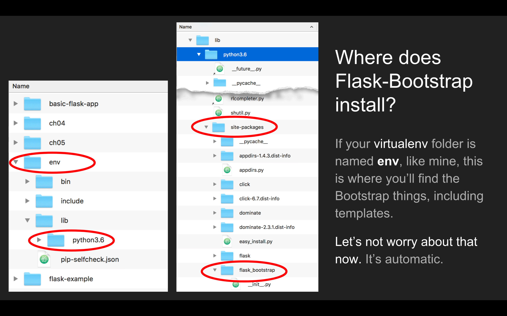
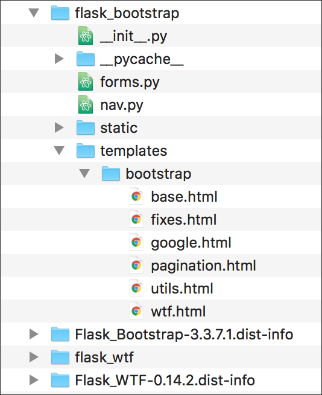

# Part 3: Forms in Flask

Flask has an extension that makes it easy to create web forms.

WTForms is “a flexible forms validation and rendering library for Python Web development.” With Flask-WTF, we get WTForms in Flask.

* WTForms includes security features for submitting form data.
* WTForms has built-in validation techniques.
* WTForms can be combined with Bootstrap to help us make clean-looking, responsive forms for mobile and desktop screens.

## Setup for using forms in Flask

We will install the **Flask-WTF** extension to help us work with forms in Flask. There are many extensions for Flask, and each one adds a different set of functions and capabilities. See the [list of Flask extensions](http://flask.pocoo.org/extensions/) for more.

In Terminal, change into your Flask projects folder and activate your virtualenv there. Then install at the bash prompt (`$`):

```bash
pip install Flask-WTF
```

We will also install the **Flask-Bootstrap** extension to provide Bootstrap styles for our forms.

```bash
pip install flask-bootstrap
```

This installation is done only once in any virtualenv. It is assumed you already have Flask installed here.

## Imports for forms with Flask-WTF and Flask-Bootstrap

You will have a long list of imports at the top of your app file:

```python
from flask import Flask, render_template
from flask_bootstrap import Bootstrap
from flask_wtf import FlaskForm
from wtforms import StringField, SubmitField
from wtforms.validators import Required
```

Note as always that Python is case-sensitive, so upper- and lowercase must be used exactly as shown. The fourth line will change depending on your form's contents.

## Set up a form in a Flask app

After the imports, these lines follow in the app script:

```python
app = Flask(__name__)

# Flask-WTF requires an encryption key - the string can be anything
app.config['SECRET_KEY'] = 'C2HWGVoMGfNTBsrYQg8EcMrdTimkZfAb'

# Flask-Bootstrap requires this line
Bootstrap(app)
```

Flask allows us to set a "secret key" value. You can grab a string from a site such as [RandomKeygen](https://randomkeygen.com/). This value is used to prevent malicious hijacking of your form from an outside submission.

Flask-WTF's `FlaskForm` will automatically create a secure session with CSRF (cross-site request forgery) protection if this key-value is set.

You can read more about `app.config['SECRET_KEY']` in [this StackOverflow post](https://stackoverflow.com/questions/22463939/demystify-flask-app-secret-key).

Next, we configure a form that inherits from Flask-WTF's `FlaskForm`. Python style dictates that a class starts with an uppercase letter and uses camel case, so here our new class is `NameForm`.

```python
class NameForm(FlaskForm):
    name = StringField('Which actor is your favorite?', validators=[Required()])
    submit = SubmitField('Submit')
```

Note that `StringField` and `SubmitField` were **imported** at the top of the file. If we needed other form fields in this form, we would need to import those. See a [list of all WTForms field types](https://github.com/macloo/flask-forms/blob/master/Resources/WTForms-field-types.csv).

WTForms also has a long list of [validators](https://github.com/macloo/flask-forms/blob/master/Resources/WTForms-validators.csv) we can use.

Now we will use the form in a Flask route:

```python
@app.route('/', methods=['GET', 'POST'])
def index():
    names = get_names(ACTORS)
    # you must tell the variable 'form' what you named the class, above
    # 'form' is the variable name used in this template: index.html
    form = NameForm()
    message = ""
    if form.validate_on_submit():
        name = form.name.data
        if name in names:
            # empty the form field
            form.name.data = ""
            id = get_id(ACTORS, name)
            # redirect the browser to another route and template
            return redirect( url_for('actor', id=id) )
        else:
            message = "That actor is not in our database."
    return render_template('index.html', names=names, form=form, message=message)
```

Before we break that down and explain it, let's look at the code in the template *index.html*:

```html





<div class="container">
  <div class="row">
    <div class="col-xs-12">

      <h1>Welcome to the best movie actors Flask example!</h1>

      <p class="lead">This is the index page for an example Flask app using Bootstrap and WTForms.</p>

      {{ wtf.quick_form(form) }}

      <p class="space-above"><strong>{{ message }}</strong></p>

    </div>
  </div>
</div>


```

**Where is the form?** This is the amazing thing about Flask-WTF &mdash; by configuring the form as we did in the Flask app, we can generate a simple form with Bootstrap styles using nothing more than the template you see above.


## Resources

[Flask-WTF documentation](https://flask-wtf.readthedocs.io/en/latest/index.html)

[Flask-Bootstrap documentation](https://pythonhosted.org/Flask-Bootstrap/)

If you want to view the Bootstrap templates installed by Flask-Bootstrap, here's how:





By viewing *base.html* in *templates/bootstrap,* you can find the Jinja2 directives that surround the HEAD, list of attached CSS files, footer area, etc. You can then use those directives in your own templates for finer control.

Note that Flask-Bootstrap uses Bootstrap 3.x, not Bootstrap 4.
