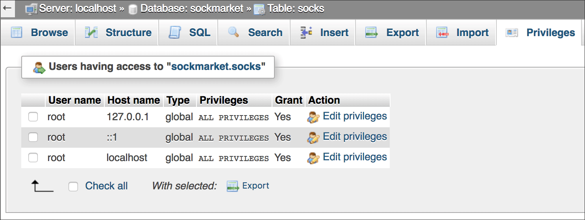

# Flask and Databases with SQLAlchemy

[SQLAlchemy](https://www.sqlalchemy.org/) is a Python SQL toolkit and object relational mapper (ORM) that enables Python to communicate with your choice of SQL database systems: MySQL, PostgreSQL, SQLite. ORM converts data between incompatible systems (object structure in Python, table structure in SQL database). SQLAlchemy is basically a bridge between Python and a SQL database.

[Flask-SQLAlchemy](http://flask-sqlalchemy.pocoo.org/) is an *extension* for Flask that adds SQLAlchemy to your Flask app.

## Contents

* [Setup for using Flask-SQLAlchemy](#setup-for-using-flask-sqlalchemy)
* [Introduction: Basics of using a database with Flask](#introduction-basics-of-using-a-database-with-flask)
* [Make a checklist for your database project](#make-a-checklist-for-your-database-project)
* [How to connect a MySQL database to a Flask app](#how-to-connect-a-mysql-database-to-a-flask-app)
  * [What could go wrong?](#what-could-go-wrong)
  * [About using XAMPP for MySQL databases](#about-using-xampp-for-mysql-databases)
* [Conclusion](#conclusion)

In separate folders:

* [Reading from a database with Flask](reading_mysql)
* [Writing to a database with Flask](writing_mysql)

Example Flask database app:

* [Sock Market](https://weimergeeks.com/flask_db2/), running on a Reclaim Hosting website

## Setup for using Flask-SQLAlchemy

We will install the **Flask-SQLAlchemy** extension to enable us to work with a SQL database in Flask. There are many extensions for Flask; each one adds a different set of functions and capabilities. See the [list of Flask extensions](http://flask.pocoo.org/extensions/) for more.

In Terminal, change into your Flask projects folder and activate your virtualenv there. Then install at the bash prompt (`$`):

```bash
pip3 install flask-sqlalchemy
```

We will also install **PyMySQL**, a MySQL client library for Python. Because SQLAlchemy can bridge between Python and various different SQL database systems, we need a library for the particular database system we will be using &mdash; MySQL. Here is the [PyMySQL documentation](http://pymysql.readthedocs.io/).

```bash
pip3 install PyMySQL
```

**IMPORTANT:** If you're using PostgreSQL or SQLite, you will not use PyMySQL. They have their own Python libraries. Look them up.

## Introduction: Basics of using a database with Flask

You’ll have to *connect* your app to an existing SQL database, whether the app reads from the database, writes to the database, or both. Connecting will require your own database username and database password. (You are the owner of the database.)

You *can* create the SQL database using Python, but *that is not required.* If you already have a database, all you need to worry about is how to connect it.

If you do use Python to create a SQL database (and that’s an “if,” not a necessity), you will only do it once. You don’t create the same database again and again.

Your database may have one table, or more than one table. That depends on what you need, or the structure of the existing SQL database.

Your app might only *read from* your SQL database. You can write SQL queries to accomplish this &mdash; use **Flask-SQLAlchemy** commands to do so.

Note that you won't write a straightforward SQL query; you will use [Flask-SQLAlchemy syntax](http://flask-sqlalchemy.pocoo.org/2.3/queries/#querying-records) instead. For example:

```python
socks = Sock.query.filter_by(style='knee-high').order_by(Sock.name).all()
```

The **Flask-SQLAlchemy** statement to the right of the equals sign, above, is equivalent to this standard SQL statement:

```sql
SELECT * FROM socks WHERE style="knee-high" ORDER BY name
```

(It is assumed you already know how to write basic SQL queries.)

In addition to *reading from* your SQL database, your app might allow people to *write to* the database. In that case, you will probably want people to log in securely. Alternatively, you might set up a Python script that updates your database on a regular schedule (e.g., writing in new records from a monthly data dump).

You might write a Python script to populate your database from the contents of a CSV file. This would be fairly simple if you only need to run it once. If you need to add records repeatedly (say, once per month) to an existing database, you might need to check whether you are *duplicating records that are already there.* If you need to check for existing records and update them, that’s more challenging.

If people are *writing into* your database, you will want to give them a web form, or forms, for doing so. See [part4_forms](../part4_forms) if you need to create a web form in your Flask app.

You will not necessarily need forms if your app only *reads from* the database.

## Make a checklist for your database project

Figure out what your own app will need to do:

1. Create a database (*optional,* because it might already exist; do this only once)
2. Connect to the database (required)
3. Read from the database: Query
   * Display all records?
   * Display a subset of records?
   * Search for multiple records?
   * Search for one record at a time?
4. Write to the database
   * Are web forms needed?
5. Allow users to write to the database
   * Insert a new record?
   * Update an existing record?
   * Delete a record?

For all Python and SQL commands, refer to the links listed under “User’s Guide” in the [Flask-SQLAlchemy documentation](http://flask-sqlalchemy.pocoo.org/).

## How to connect a MySQL database to a Flask app

There's a starter script in this repo for testing whether you can connect: [local_db_test.py](local_db_test.py).

The script makes several assumptions. The biggest assumption is that you already have an existing MySQL database up and running on *your local machine.* Other assumptions should be clear to you from the comments in the code. Make changes to the script as needed to match your database environment.

To run the script, activate your virtualenv and start up your database server.

```bash
python local_db_test.py
```

Open a new tab in your web browser and enter `localhost:5000/` in the address bar. If you see "It works" in the window, then this code is your starting base for further work with Flask-SQLAlchemy and your database. If you see "Something is broken," check the Terminal for an error description.

### What could go wrong?

* You forgot to install PyMySQL or Flask-SQLAlchemy in your virtualenv.
* Your virtualenv has not been activated.
* Your username and/or password for the database are wrong in line 16. If you changed them, maybe you shouldn’t have.
* Your database name is wrong in line 19.
* The socket (line 21) does not match what you need on your computer.



*Note that this is a local MySQL database, running on the same computer as the Flask app. The database* sockmarket *has only one user, root, and no password. This is acceptable on a local machine ONLY. Always use a username and a strong password on a live web server!*

There's a second starter script in this repo for testing whether you can connect on **a hosted website** that provides phpMyAdmin: [host_db_test.py](host_db_test.py). Before running it, make sure you've set up a MySQL database with at least one table in it.

### About using XAMPP for MySQL databases

When we created MySQL databases at the beginning of my course, we used [XAMPP](https://www.apachefriends.org/index.html) to do so. This is a great option and works pretty much identically on Mac, Windows and Linux. Unlike [MAMP](https://www.mamp.info/), there's no paid version of XAMPP. XAMPP is just plain free.

 However, if you've downloaded the **VM** version of XAMPP for Mac (not an issue for Windows on Linux), the code in *local_db_test.py* is not going to work. The solution is to [go to this XAMPP download page](https://www.apachefriends.org/download.html#download-apple) and download the highest-numbered version that does NOT say "XAMPP-VM."

 If you already installed the VM version, uninstall it and install the non-VM version.

## Conclusion

This has been a basic introduction to getting started with Flask-SQLAlchemy and a MySQL database.

You have not done any reading from or writing to the database yet. That comes next, in [reading_mysql](reading_mysql).
