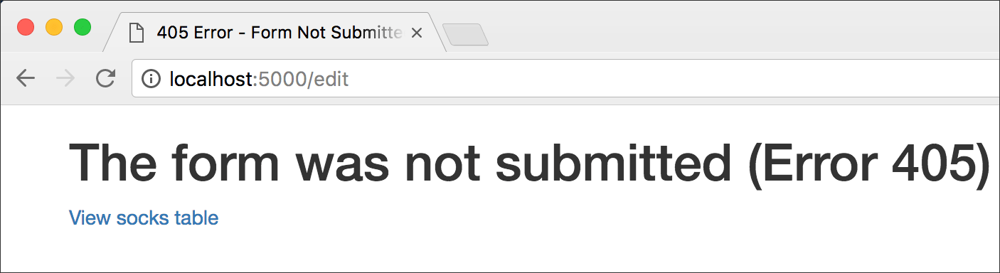

# Writing to a MySQL database

Parts of the app described here are duplicated from the app explained in [reading_mysql](../reading_mysql), so those parts will not be repeated here.

Prerequisites for this tutorial are explained in the README in [part6_databases](../../part6_databases) in this repo. It's essential to get your database connection working without errors before you try doing more with the database and Flask.

## Contents

## Add, update or delete a database record

The purpose of this section (and its Flask app) is to show how to write to a MySQL database using **Flask-SQLAlchemy** commands.

*Writing* to the database can happen in three different ways, and there are different commands for each of these.

1. Add a new record: Create a complete new entry and add it to the database.
2. Update a record: Retrieve an existing record and allow the user to edit any part of it, then write the changes to the database.
3. Delete a selected record.

For option 1, we do not have to find a record in the database. We give the user an empty form, and the user fills it in and submits it. (Alternatively, new records could be added to the database from a file, without using a form. That is not done in this app.)

For options 2 and 3, we must identify the existing record.

For option 2, we can use the same form used for option 1, but we must fill it in with all the existing data. Then the user changes whichever items need editing and submits the form. (Alternatively, a script could check a file to find records that had changed and then update them without using a form.)

For option 3, after identifying the desired record, we need to remove it completely from the database.

# The forms

This Flask app includes four forms. Three of those are **Flask-WTF** forms as described in [part4_forms](../../part4_forms) in this repo.

The first form we see is actually a table containing all the contents of the MySQL database. Each record row begins with a radio button, allowing the user to select one (and only one) record for editing or deleting. This form is built from the database using Jinja2 template commands in the template file [table.html](flask-db-write/templates/table.html). The value of the radio button control is the record ID from the database.

The other three forms are built with Flask-WTF, and so Python classes are built for them in [app.py](flask-db-write/app.py):

* `UpdateChoiceForm()`
* `DeleteChoiceForm()`
* `AddRecord()`

Only `AddRecord()` uses `wtf.quick_form()` in its template, [add.html](flask-db-write/templates/add.html). The other two forms are coded in their respective templates, [update_record.html](flask-db-write/templates/update_record.html) and [delete_record.html](flask-db-write/templates/delete_record.html).

## Things carried over from the previous section

We're using the same "Sock Market" database.

The imports, the database connection, and the configuration of the database model for SQLAlchemy are *all the same* as in the previous section, [reading_mysql](../reading_mysql).

There are additional form controls imported `from wtforms`, as needed for the forms in this app.

Several form validators are imported `from wtforms.validators`; these are used to ensure that invalid data cannot be submitted, such as a number where a string is required.

Finally, there's this import:

```python
from datetime import date
```

`date` is used in a small function, `stringdate()`, in *app.py*. It constructs a text string containing today's date so that string can be submitted as part of a new database record.

## Examining the Flask route functions

Let's see what each route does, with particular attention to when the Flask app *writes to* the database.

### View the entire database as a table.

```python
@app.route('/')
def sock_table():
    socks = Sock.query.order_by(Sock.name).all()
    return render_template('table.html', socks=socks)
```

Here we do not write to the database; we simply view all the records. The Flask-SQLAlchemy query is equivalent to `SELECT * FROM socks ORDER BY name`.

### A choice to edit or delete the selected record.

```python
@app.route('/edit', methods=['POST'])
def edit():
    # if POST and id received, do this
    id = request.form['id']
    the_sock = Sock.query.filter_by(id=id).first_or_404()
    # two forms - so they can be submitted to different routes
    form1 = UpdateChoiceForm()
    form2 = DeleteChoiceForm()
    return render_template('sock.html', the_sock=the_sock, id=id, form1=form1, form2=form2)
```

Here we also do not write to the database. The function expects the HTTP request to have come from a form (`methods=['POST']`). The form will have sent the ID of one database record. Two forms are in the template, although the user sees only their submit buttons &mdash; the ID is in a hidden field in each form, and each form is configured to call *a different route*.

If the route is called without a secure form submission, an error route (405) is called.



See the template [sock.html](flask-db-write/templates/sock.html).

### Update a record, step 1.

```python
@app.route('/update', methods=['POST'])
def update():
    # if POST and id received, provide filled-in form to edit
    id = request.form['id_field']
    the_sock = Sock.query.filter_by(id=id).first()
    form3 = AddRecord(obj=the_sock)
    return render_template('update_record.html', the_sock=the_sock, id=id, form3=form3)
```

Still not writing to the database, although now we are close to it &mdash; here the user sees a form filled in with the complete contents of one record. This record was selected from the big table, and the user chose “Update This Record.” The ID for the selected record is passed to this route by the update form (form1) in [sock.html](flask-db-write/templates/sock.html).


### Delete a record, step 1.

```python
@app.route('/delete', methods=['POST'])
def delete():
    # if POST and id received, ask for confirmation to delete
    id = request.form['id_field']
    the_sock = Sock.query.filter_by(id=id).first()
    form2 = DeleteChoiceForm()
    return render_template('delete_record.html', the_sock=the_sock, id=id, form2=form2)
```

Also not writing to the database &mdash; here the user sees an “Are you sure?” message with regard to deleting one record. The record was selected from the big table, and the user chose “Delete This Record.” The ID for the selected record is passed to this route by the delete form (form2) in [sock.html](flask-db-write/templates/sock.html).

The same form appears *again* in this template, [delete_record.html](flask-db-write/templates/delete_record.html) &mdash; but the form's `action` attribute is different.

### Update a record, step 2.

This is the most complex route because to *update an existing record,* we need to retrieve and fill in all the existing data from that record.

We are also checking (with `if`/`else`) that the form fields validate.

And *finally,* we are *writing to the database.* See if you can identify where that happens.

```python
# handle the update when form is submitted
@app.route('/update_result', methods=['POST'])
def update_result():
    id = request.form['id_field']
    the_sock = Sock.query.filter_by(id=id).first()
    sockname = the_sock.name
    purpose = 'updated'
    form3 = AddRecord()
    if form3.validate_on_submit():
        # update the db sock record with form values
        the_sock.name = request.form['name']
        the_sock.style = request.form['style']
        the_sock.color = request.form['color']
        the_sock.quantity = request.form['quantity']
        the_sock.price = request.form['price']
        # get today's date from function, above all the routes
        the_sock.updated = stringdate()
        # update database record
        db.session.commit()
        return render_template('result.html', result=purpose, sockname=sockname)
    else:
        # display error messages while keeping newly entered values
        # obtained from the form itself, not from the db
        flash('placeholder')
        the_sock.id = id
        the_sock.name = form3.name.data
        the_sock.style = form3.style.data
        the_sock.color = form3.color.data
        the_sock.quantity = form3.quantity.data
        the_sock.price = form3.price.data
        return render_template('update_record.html', form3=form3, the_sock=the_sock)
```

In the `if` block (below `if form3.validate_on_submit():`), we finally see how Flask-SQLAlchemy write to the database:

```python
db.session.commit()
```

In that small line, you get SQL-injection protection, transaction integrity, and all the tricky database things that require a lot more code with other languages and systems (such as PHP).

In the `else` block, we ensure that error messages are written if the user filled any form fields with invalid data, and the form is not submitted.

Remember that `db` was assigned near the top of the app:

```python
db = SQLAlchemy(app)
```

### Delete a record, step 2.

This route function is not as long as the previous one because we don't need to manage the form data for every field in the record &mdash; we only need to delete it.

```python
# perform the deletion of one sock record
@app.route('/deletion_result', methods=['POST'])
def deletion_result():
    id = request.form['id_field']
    purpose = request.form['purpose']
    the_sock = Sock.query.filter_by(id=id).first()
    sockname = the_sock.name
    if purpose == 'deleted':
        db.session.delete(the_sock)
        db.session.commit()
    else:
        # if value of purpose was other than expected
        return render_template('405.html'), 405
    return render_template('result.html', result=purpose, sockname=sockname)
```

Once again, we're relying on the ID passed to this route by a form &mdash; the ID field is the primary key column in the database.

The Flask-SQLAlchemy commands that *interact with the database* in this case are:

```python
db.session.delete(the_sock)
db.session.commit()
```

You can read up on [how a SQLAlchemy session works](http://docs.sqlalchemy.org/en/latest/orm/session_basics.html), but the simplest way to think about it is that a session ensures that your entire transaction with the database gets done, with no sloppy unfinished business.

### Add a new record to the database.

This is similar to the `update_result()` function above, but it's simpler because we don't get anything *from* the database &mdash; not even an ID. We give the user an empty form to fill in, and we write error messages on the form if it fails to validate when they try to submit it.

```python
# add a new sock to the database
@app.route('/add', methods=['GET', 'POST'])
def add():
    form3 = AddRecord()
    if form3.validate_on_submit():
        name = request.form['name']
        style = request.form['style']
        color = request.form['color']
        quantity = request.form['quantity']
        price = request.form['price']
        # get today's date from function, above all the routes
        updated = stringdate()
        # the data to be inserted into Sock model - the table, socks
        record = Sock(name, style, color, quantity, price, updated)
        # Flask-SQLAlchemy magic adds record to database
        db.session.add(record)
        db.session.commit()
        # create a message to send to the template
        message = "The data for sock %s has been submitted." % (name)
        return render_template('add.html', message=message)
    else:
        # show validaton errors
        flash('placeholder')
        return render_template('add.html', form3=form3)
```

The Flask-SQLAlchemy commands that *write to the database* in this case are:

```python
db.session.add(record)
db.session.commit()
```

Note that `record` is a new variable that was assigned just before those two lines.

## Conclusion

TK
