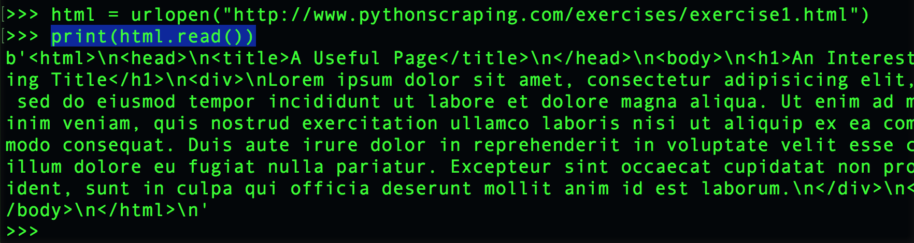

# Introduction to Web Scraping

We use this book: *Web Scraping with Python: Collecting More Data from the Modern Web,* 2nd edition, by Ryan Mitchell (O’Reilly, 2018). We must use [the 2nd edition](http://shop.oreilly.com/product/0636920078067.do), because there are many changes from the previous edition.

Python3 is used throughout this book.

**Note:** This document assumes you have already installed Python3, *pip*, and *virualenv*. If not, refer to [these instructions](http://bit.ly/install-python3-jupyter).

This document covers our second week in this section of the course. It's our second week with Python, and our first week with scraping.

## Contents

* [Setup for BeautifulSoup](#setup-for-beautifulsoup)
    * [Create a directory and change into it](#create-a-directory-and-change-into-it)
    * [Create a new virtualenv in that directory and activate it](#create-a-new-virtualenv-in-that-directory-and-activate-it)
    * [Install the BeautifulSoup library](#install-the-beautifulsoup-library)
    * [Test BeautifulSoup](#test-beautifulsoup)
* [Understanding BeautifulSoup](#understanding-beautifulsoup)
    * [What is the BeautifulSoup object?](#what-is-the-beautifulsoup-object)
    * [How BeautifulSoup handles the object](#how-beautifulsoup-handles-the-object)
    * [Finding elements that have a particular class](#finding-elements-that-have-a-particular-class)
    * [Finding all vs. finding one](#finding-all-vs-finding-one)
    * [Finding the contents of a particular attribute](#finding-the-contents-of-a-particular-attribute)

See also, elsewhere in this repo:

* [mitchell-ch3](https://github.com/macloo/python-beginners/tree/master/web_scraping/mitchell-ch3) &mdash; Mitchell chapter 3: More web scraping. This covers our third week's assigned reading.
* [more-from-mitchell](https://github.com/macloo/python-beginners/tree/master/web_scraping/more-from-mitchell) &mdash;  More from Mitchell: Web scraping beyond the basics. This covers our fourth week's assigned reading.

BeautifulSoup documentation:

* [A nicely formatted PDF](https://media.readthedocs.org/pdf/beautiful-soup-4/latest/beautiful-soup-4.pdf)
* [The official docs](https://www.crummy.com/software/BeautifulSoup/bs4/doc/)

## Setup for BeautifulSoup

**BeautifulSoup** is a scraping library for Python. We want to run all our scraping projects in a virtual environment. Students have already installed both Python3 and virtualenv.

* [Install Python3, virtualenv, Jupyter](http://bit.ly/install-python3-jupyter)

### Create a directory and change into it

The first step is to create a new folder (directory) for all your scraping projects. Mine is:

```bash
Documents/python/scraping
```

Do not use any spaces in your folder names. If you must use punctuation, do not use anything other than an underscore (\_). It's easiest if you use only lowercase letters.

**Change into that directory.** For me, the command would be:

```bash
cd Documents/python/scraping
```

### Create a new virtualenv in that directory and activate it

Create a new **virtualenv** there (this is done only once).

**Mac OS/bash**
```bash
$ virtualenv --python=/usr/local/bin/python3 env
```

Skip to **Continue ...** below.

**Windows PowerShell**
```bash
PS> virtualenv --python=C:\Python37\python.exe env
```
Note: On Windows, this might not be the location of your Python 3. To find the location, start the Python 3 interpreter and try this code to find your installed Python path:
```
>>> import os
>>> import sys
>>> os.path.dirname(sys.executable)
```
The next line will be the path on your computer. Use the code shown above, but replace `C:\Python37\` with that new line you just got. Make sure to keep `python.exe env` at the end.

#### Continue ...

Activate the **virtualenv**:

**Mac OS/bash**
```bash
$ source env/bin/activate
```

**Windows PowerShell**
```bash
PS> env\Scripts\activate.bat
```
Note: The command on Windows might be different, depending on what you are using. The uppercase S is necessary.

**Important:** You should now see `(env)` at the far left side of your prompt. This indicates that the **virtualenv** is active. Example (Mac OS/bash):

```bash
(env) mcadams scraping $
```

When you are finished working in a **virtualenv**, you should *deactivate* it. The command is the same in Mac OS or Windows (DO **NOT** DO THIS NOW):

```
deactivate
```

You'll know it worked because `(env)` will no longer be at the far left side of your prompt.

### Install the BeautifulSoup library

In Mac OS or Windows, at the `$` bash prompt (or Windows `PS>`), type:

```bash
pip3 install beautifulsoup4
```

This is how you install *any* Python library that exists in the [Python Package Index](https://pypi.python.org/pypi). Pretty handy. **pip** is a tool for installing Python packages, which is what you just did.

**Note:** You installed BeautifulSoup in the Python3 **virtualenv** that is currently active. When that **virtualenv** is *not* active, BeautifulSoup will not be available to you. This is ideal, because you will create different virtual environments for different Python projects, and you won't need to worry about updated libraries in the future breaking your (past) code.

### Test BeautifulSoup

**Start Python.** Because you are in a Python3 **virtualenv**, you need only type `python`.

You should now be at the `>>>` prompt &mdash; the Python prompt.

In Mac OS or Windows, type (or copy/paste) *one line at a time*:

```python
from urllib.request import urlopen
from bs4 import BeautifulSoup
html = urlopen("https://weimergeeks.com/examples/scraping/example1.html")
bsObj = BeautifulSoup(html, "html.parser")
print(bsObj.h1)
```

1. You imported two Python modules, `urlopen` and `BeautifulSoup` (the first two lines).
2. You used `urlopen` to copy the entire contents of the URL given into a new Python variable, `html`.
3. You used `BeautifulSoup` to process the value of that variable (the contents of the file at that URL) through a built-in HTML parser (`html.parser` is not the only option for this; `html5lib` is more robust and can be installed with *pip*). The result: All the HTML from the file is now in a BeautifulSoup object with the new Python variable name `bsObj`.
4. Using the syntax of the BeautifulSoup library, you printed the first H1 element (including its tags) from that parsed value. Check out [the page on the web](https://weimergeeks.com/examples/scraping/example1.html) to see what you scraped.

If it works, you'll see:

```python
<h1>We Are Learning About Web Scraping!</h1>
```

If you got an error about SSL, quit Python (`quit()` or Command-D) and enter this at the bash prompt:

```bash
/Applications/Python\ 3.6/Install\ Certificates.command
```

Then return to the Python prompt and retry the five lines above.

The example is based on the one on page 8 of Mitchell's book; the code is updated in her [GitHub repo](https://github.com/REMitchell/python-scraping) (chapter1) for the book, where we can find **updated code** that will no doubt appear in her 2nd edition.

The command `bsObj.h1` would work the same way for any HTML tag (if it exists in the file). Instead of printing it, you might stash it in a variable:

```python
heading = bsObj.h1
```

## Understanding BeautifulSoup

BeautifulSoup is a Python library that enables us to extract information from web pages and even entire websites.

We use BeautifulSoup commands to create a well-structured data *object* (more about objects below) from which we can extract, for example, everything with an `<li>` tag, or everything with `class="book-title"`.

After extracting the desired information, we can use other Python commands (and libraries) to write the data into a database, CSV file, or other usable format.

### What is the BeautifulSoup object?

It's very important to understand that many of the BeautifulSoup commands work on an *object*, which is not the same as a simple *string*. Throughout her book, Mitchell uses the variable name `bsObj` to remind us of that fact.

Many programming languages include objects as a data type. Python does, JavaScript does, etc. An *object* is an even more powerful and complex data type than an *array* (JavaScript) or a *list* (Python) and can contain many other data types in a structured format.

When you extract information from an *object* with a BeautifulSoup command, sometimes you get a simple string, and sometimes you get a Python *list* (which is very similar to an *array* in JavaScript). The way you treat that extracted information will be **different** depending on whether it is a string (*one* item) or a list (usually *more than one* item).

### How BeautifulSoup handles the object

In the previous code, when this line ran:

```python
html = urlopen("https://weimergeeks.com/examples/scraping/example1.html")
```

... you copied the entire contents of a file into a new Python variable named `html`. The contents were stored as an *HTTPResponse object*. We can read the contents of that object like this:



... but that's not going to be very usable, or useful &mdash; especially for a file with a lot more content in it.

When you transform that *HTTPResponse object* into a *BeautifulSoup object* &mdash; with the following line &mdash; you create a well-structured object from which you can extract *any HTML element* and the text *within* any HTML element.

```python
bsObj = BeautifulSoup(html, "html.parser")
```

Let's look at a few examples of what BeautifulSoup can do.

### Finding elements that have a particular class

Deciding the best way to extract what you want from a large HTML file requires you to dig around in the source before you write the Python/BeautifulSoup commands. In many cases, you'll see that everything you want has the same **CSS class** on it. After creating a *BeautifulSoup object* (here, as before, it is in the variable `bsObj`), this line will create a Python *list* (you can think of it as an *array*) containing all the `<td>` elements that have the class `city`.

```python
city_list = bsObj.findAll( "td", {"class":"city"} )
```

Maybe there were 10 cities in `<td>` tags in that HTML file. Maybe there were 10,000. No matter how many, they are now in a *list* (in the variable `city_list`), and you can search them, print them, write them out to a database or a JSON file &mdash; whatever you like. Often you will want to perform the same actions on each item in the list, so you will use a *for-loop*:

```python
for city in city_list:
    print( city.get_text() )
```

`get_text()` is a handy BeautifulSoup method that will extract the text &mdash; and only the text &mdash; from the item. If instead you wrote just `print(city)`, you'd get the `<td>` and any other tags inside them as well.

### Finding all vs. finding one

The BeautifulSoup `findAll()` method you just saw always produces a *list*. If you know there will be only one item of the kind you want in a file, you should use the `find()` method instead.

For example, maybe you are scraping the address and phone number from every page in a large website. There is only one phone number on the page, and it is enclosed in a pair of tags with the attribute `id="call"`. One line of your code gets the phone number from the current page:

```python
phone_number = bsObj.find(id="call")
```

Naturally, you don't need to loop through that result &mdash; the variable `phone_number` will contain only a string, including any HTML tags. To test what the text alone will look like, just print it using `get_text()` to strip out the tags.

```python
print( phone_number.get_text() )
```

Notice that you're always using `bsObj`. Review above if you've forgotten where that came from.

### Finding the contents of a particular attribute

One last example: You've made a BeautifulSoup object from a page that has dozens of images on it. You want to capture the path to each image file on that page (perhaps so that you can download all the images). This requires two steps:

```python
image_list = bsObj.findAll('img')
for image in image_list:
    print(image.attrs['src'])
```

First, you make a Python *list* containing all the `img` elements that exist in the object.

Second, you loop through that list and print the contents of the `src` attribute from each `img` tag in the list.

We do not need `get_text()` in this case, because the contents of the `src` attribute are nothing but text. There are never tags inside the `src` attribute.

There's a lot more to learn about BeautifulSoup, and we'll be using Mitchell's book for that. You can also [read the docs](https://www.crummy.com/software/BeautifulSoup/bs4/doc/).
